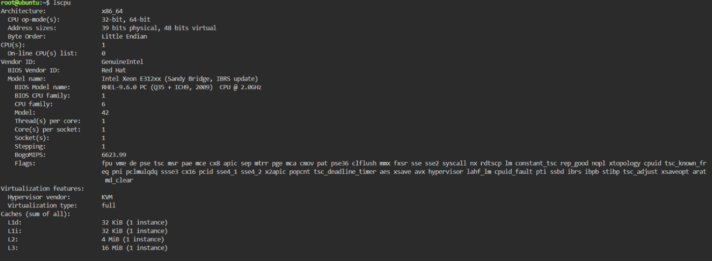
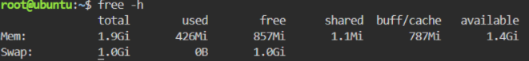

## Checkpoint 7 – Continue Your Linux Investigation

### Linux Server Investigation

The Linux server was examined using the KillerCoda Playground and some basic Linux commands. The goal was to check the server's operating system, CPU details, memory usage, and available disk space.

### Operating System

Command used: `cat /etc/os-release`

This command was used to find out which operating system and version are currently running on the Linux server.

### CPU Information

Command used: `lscpu`

This command was used to check the CPU architecture, processor details, and the number of CPUs available on the server.

### Memory

Command used: `free -h`

This command was used to check the total memory, the amount being used, and the memory that is still available on the Linux server.

### Disk Space

Command used: `df -h`

This command was used to check the total disk space, used storage, available space, and mounted file systems on the server.

### Cloud Migration Options

If the Linux server needs to be moved to the cloud, it can be hosted using virtual machine services from AWS, Microsoft Azure, or Google Cloud.

| Cloud Provider  | Cloud Service          | Purpose                                    |
| --------------- | ---------------------- | ------------------------------------------ |
| AWS             | Amazon EC2             | Runs the Linux server as a virtual machine |
| Microsoft Azure | Azure Virtual Machines | Hosts and runs the Linux server            |
| Google Cloud    | Compute Engine         | Runs the Linux server as a virtual machine |

All three cloud providers support Linux virtual machines. The best option can be chosen based on factors such as CPU, memory, storage, operating system, workload, cost, scalability, and networking needs.

### Conclusion

The Linux server investigation showed how simple Linux commands can be used to check important server resources, including the operating system, CPU, memory, and disk space. Knowing these details is helpful when planning a cloud migration because they can be used to choose the right virtual machine configuration. AWS EC2, Azure Virtual Machines, and Google Compute Engine are all capable of hosting the Linux server in the cloud.

