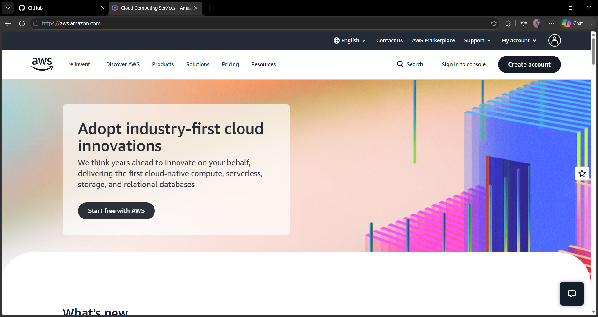

# Amazon Web Services (AWS) Research

## 1. Brief Overview

Amazon Web Services (AWS) is a cloud computing platform offered by Amazon. It provides many different cloud services that organizations can use to create, run, and manage applications without having to maintain all of their own physical servers and infrastructure. AWS offers services for computing, storage, databases, networking, security, analytics, artificial intelligence, and other technology needs.

## 2. Global Infrastructure

AWS has a worldwide cloud infrastructure that is divided into **Regions** and **Availability Zones**. A Region is a specific geographic location, while Availability Zones are separate and isolated locations within a Region. This setup allows organizations to run applications closer to their users and helps improve availability and reliability. AWS also provides **Local Zones** and **Wavelength Zones** for applications that need cloud resources located closer to users or specific networks.

## 3. Cloud Management Console

The **AWS Management Console** is a web-based platform that users can access to manage AWS services and resources. It provides a central place where users can search for services, manage resources, check notifications, use CloudShell, and manage their AWS account information.

## 4. Four Core Services

### Amazon EC2

**Amazon Elastic Compute Cloud (Amazon EC2)** provides virtual servers that users can use to run applications, websites, and other workloads in the AWS cloud.

### Amazon S3

**Amazon Simple Storage Service (Amazon S3)** is an object storage service used to save and access files, data, backups, and other digital objects.

### Amazon RDS

**Amazon Relational Database Service (Amazon RDS)** is a managed service that makes it easier for users to create, operate, and scale relational databases in the cloud.

### Amazon VPC

**Amazon Virtual Private Cloud (Amazon VPC)** allows users to create an isolated and private network environment where AWS resources can be deployed and managed securely.

## 5. Three Advantages

1. **Wide range of services** – AWS provides many different services for computing, storage, networking, databases, security, analytics, and other technologies.
2. **Global infrastructure** – AWS has Regions and Availability Zones in different parts of the world, allowing organizations to choose locations that are suitable for their users and applications.
3. **Scalability and flexibility** – Organizations can increase or reduce their cloud resources depending on their workload and current needs.

## 6. Typical Enterprise Use Cases

AWS is widely used by businesses and organizations for websites and mobile applications, data storage and backups, database hosting, software development, disaster recovery, analytics, and large business applications. By combining different AWS services, organizations can create systems that are scalable, reliable, and highly available.

## 7. Screenshot

*Figure 1. AWS official homepage.*

