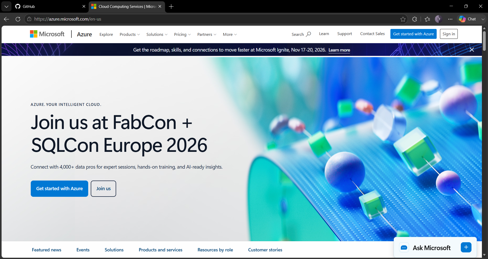

# Microsoft Azure Research

## 1. Brief Overview

Microsoft Azure is a cloud computing platform created by Microsoft. It offers different cloud services that organizations can use to create, run, manage, and scale their applications and IT systems. Azure provides services for computing, storage, networking, databases, security, data analytics, artificial intelligence, and software development.

## 2. Global Infrastructure

Azure has a worldwide cloud infrastructure made up of different geographic regions and data centers. These regions allow organizations to run their applications and services in different locations around the world. Azure also offers **Availability Zones** in supported regions, which can help improve the availability and reliability of applications by separating resources across different locations.

## 3. Cloud Management Console

The **Azure Portal** is a web-based platform used to manage Azure services and resources. It allows users to create, configure, monitor, and manage their cloud resources through a graphical interface. Users can also access services, resource groups, dashboards, subscriptions, and other tools needed to manage their Azure environment.

## 4. Four Core Services

### Azure Virtual Machines

**Azure Virtual Machines** provide virtual computing resources that organizations can use to run operating systems, applications, and other workloads in the cloud.

### Azure Blob Storage

**Azure Blob Storage** is an object storage service used to store large amounts of unstructured data. Examples include documents, images, videos, backups, and application files.

### Azure Virtual Network

**Azure Virtual Network** allows organizations to create private networks within Azure. It helps resources communicate securely with each other and can also connect Azure resources to an organization's existing on-premises network.

### Azure SQL Database

**Azure SQL Database** is a managed relational database service that uses Microsoft SQL Server technology. It allows organizations to use SQL databases in the cloud without having to manage the physical database infrastructure themselves.

## 5. Three Advantages

1. **Strong Microsoft integration** – Azure works closely with Microsoft technologies such as Windows Server, Microsoft 365, Active Directory, and SQL Server.
2. **Global infrastructure** – Azure has regions and data centers in many different parts of the world, giving organizations several options for deploying their applications.
3. **Enterprise capabilities** – Azure provides many services for security, identity management, networking, databases, analytics, artificial intelligence, and hybrid cloud environments.

## 6. Typical Enterprise Use Cases

Azure is commonly used by businesses for hosting applications, running Windows Server workloads, managing databases and virtual machines, supporting Microsoft-based business systems, performing data analytics, using artificial intelligence, creating backups, and handling disaster recovery. Organizations that already use Microsoft technologies can also connect their existing systems and infrastructure with Azure services.

## 7. Screenshot

*Figure 1. Microsoft Azure official homepage.*

