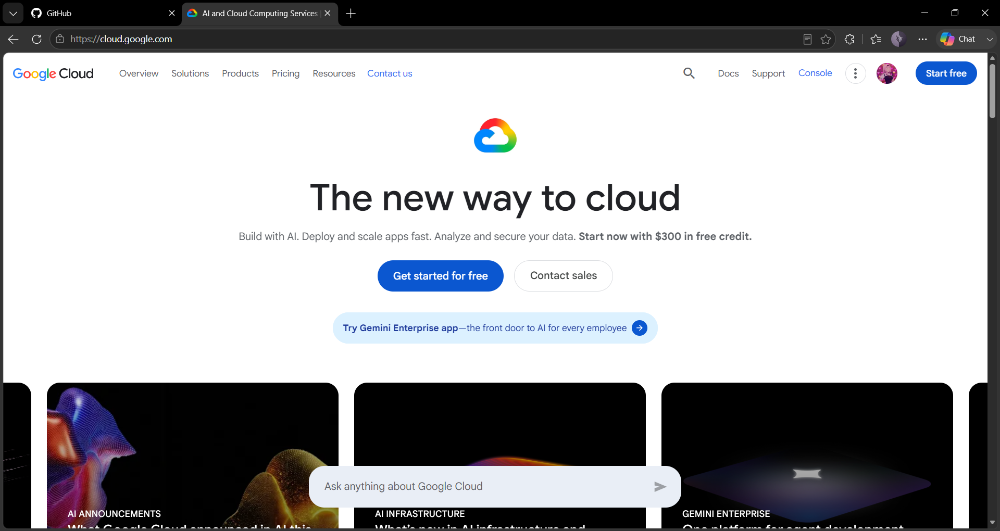

# Google Cloud Platform (GCP) Research

## 1. Brief Overview

Google Cloud Platform (GCP), also called Google Cloud, is a cloud computing platform offered by Google. It provides different services for computing, storage, databases, networking, data analytics, artificial intelligence, machine learning, and application development. Organizations can use Google Cloud to create, run, and scale their applications and IT infrastructure using Google's cloud technology.

## 2. Global Infrastructure

Google Cloud has cloud infrastructure located in different regions and zones around the world. A **region** is a specific geographic area that contains multiple **zones**. Zones are separate locations within a region that help protect resources from certain infrastructure problems. Organizations can spread their resources across different regions and zones to improve the availability, reliability, and performance of their applications.

## 3. Cloud Management Console

The **Google Cloud Console** is a web-based platform used to manage Google Cloud resources and services. Users can use it to create and set up resources, monitor applications, manage projects, and access different cloud services. Google Cloud also allows users to manage their resources through the **Google Cloud CLI** and APIs.

## 4. Four Core Services

### Compute Engine

**Compute Engine** provides virtual machines that run on Google's cloud infrastructure. These virtual machines can be used to host websites, applications, databases, and other types of workloads.

### Cloud Storage

**Cloud Storage** is an object storage service that allows users to store and access different types of data, such as files, backups, videos, images, and application data.

### Cloud SQL

**Cloud SQL** is a managed relational database service that supports database systems such as MySQL, PostgreSQL, and SQL Server. It makes managing databases in the cloud easier for organizations.

### Google Kubernetes Engine

**Google Kubernetes Engine (GKE)** is a managed Kubernetes service that helps users deploy, manage, and scale applications that run in containers.

## 5. Three Advantages

1. **Strong AI and machine learning capabilities** – Google Cloud provides many tools and services that can be used for artificial intelligence and machine learning projects.
2. **Kubernetes expertise** – Google Cloud provides Google Kubernetes Engine (GKE), which makes it easier to manage and run applications that use containers.
3. **Global infrastructure** – Google Cloud has regions and zones in different parts of the world, allowing organizations to run applications closer to their users and improve reliability.

## 6. Typical Enterprise Use Cases

Google Cloud is commonly used by businesses and organizations for artificial intelligence, machine learning, data analytics, big data processing, websites, applications, containerized applications, databases, and other cloud-based systems. Companies can combine services such as Compute Engine, Cloud Storage, BigQuery, Cloud SQL, and Google Kubernetes Engine to build cloud solutions that can grow and handle different workloads.

## 7. Screenshot

*Figure 1. Google Cloud official homepage.*
